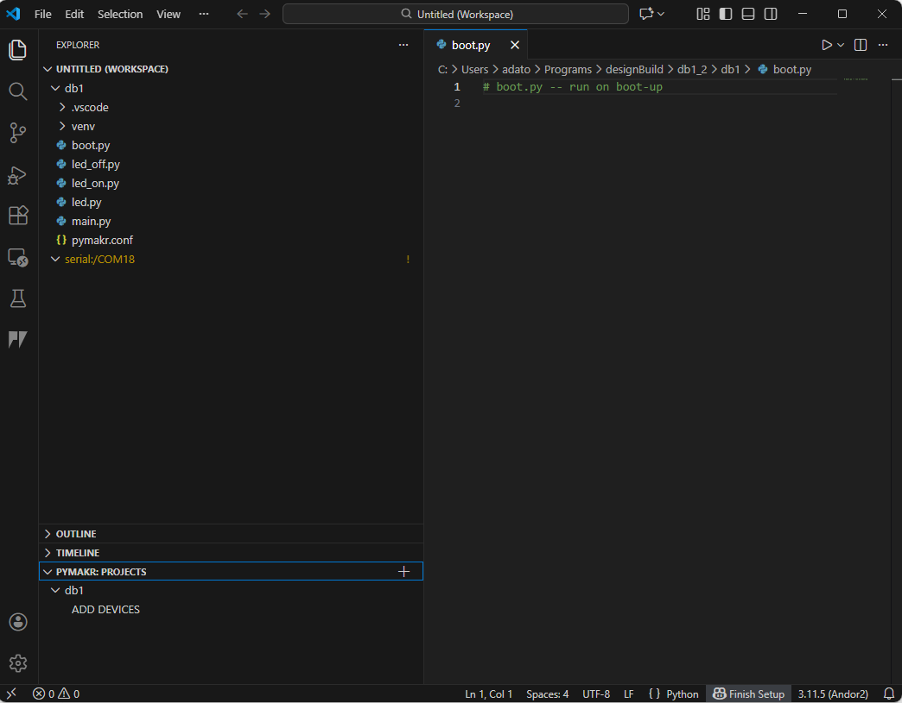
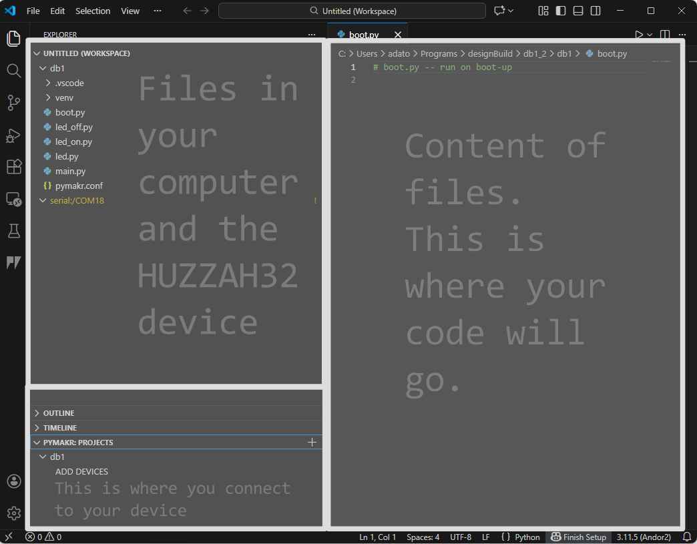
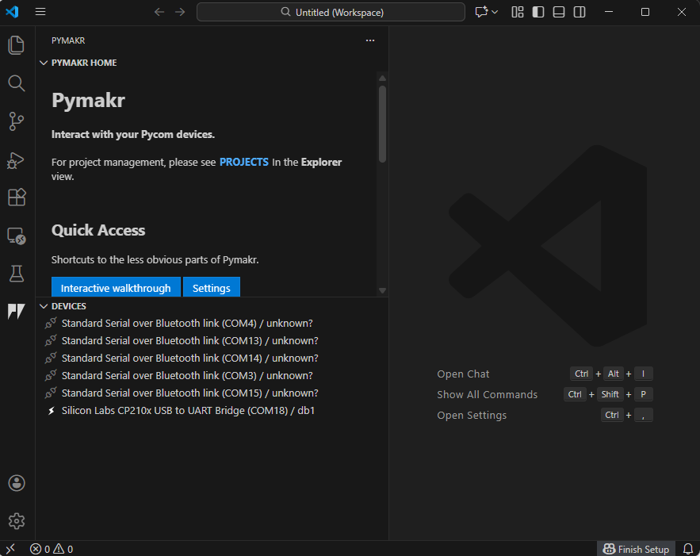
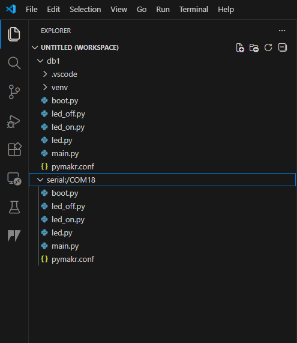
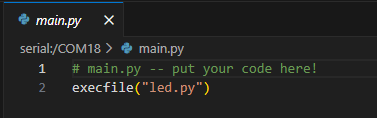

# Connecting to HUZZAH32

This following is a **group work**! Make sure to have all your group assembled before starting it. It is important that all of the members of your group understand how to work with the HUZZAH32 board. That is because your group will be split to go to the labs. One of the biggest challenges previous years for almost all groups was that some members missed key basic operation procedure and couldn't proceed with the lab work and data retrieval. 
> :warning: It is your group responsibility to ensure that you are all up to speed. In the case of extreme misunderstanding regarding this, you can always talk to your TAs and the teacher. 

## Integrated development environment (IDE)

In this course, you are required to work with the Visual Studio Code IDE. This will allow us to help you efficiently in case you run into troubles. Let's take a look at the basic layout of VS code. 

| Visual studio code layout | Commented parts of the layout | 
| ------ | ------------- | 
|  | 

Note the main windows of your IDE:
- The large window on the right is where the content of your files appears. This will typically be the text of your program. You can also split this view to show multiple files at the time.
- The smaller windows on the right shows the file system of the folder you are working with. You can change this folder by going to `File - Open folder`. 
  - >:warning:You should be working only in the folder `db1` created by the provided isntallation script. 
- The smallest window bellow the file system is from PyMakr, the package that manages connection to your HUZZAH32 device. In it, you can monitor connection to it, download data from the device or upload your scripts to it. 

----

If your installation completed successfully, you should see PyMakr icon on the left side of the VS code. 

In here, you can see all possible serial connecctions your computer can engage in. Once you connect your HUZZAH32 to your computer, it should show up here as a "UART bridge". You have a limited set of ways to engage with the device here as well (e.g, connect/disconnect), but we will generally aim to use the "Exlorer" view (the first of the side icons).

## Adding HUZZAH32 to your projectr

:warning: **Start by connecting the HUZZAH32 to the computer you are working with. Use the provided USB cable.**

To start uploading your code to the HUZZAH32, we need to first add it to the project. This is done in the "Explorer" view where at the bottom, you should see a panel on the left side titled ">PYMAKR: PROJECTS". 

You can add your device by clicking on the "ADD DEVICES" option. This will open a list of available devices, where you should select HUZZAH32. It will typically only show the communication chip which is not very informative, but it will most likely the only UART bridge connection your computer will have available.

Once you have added your HUZZAH32 device, you should the name of the communication chip (Silicon Labs CP220x) and a number of options. Most of them will be in grey except a little lightning bolt :zap: icon. Clicking on it will connect your connect your HUZZAH32 and enable further options.

### Stopping a running script

HUZZAH32 may be already running a program when you are trying to connect to it. The connection will proceed, but most options (upload/download) will not be available. You will also see a set of rotating arrows :arrows_clockwise: indicating the device is busy. 

To be able to communicate with your device, you need to stop the running script. You can do that by clicking on the ... icon. There you will encounter several more options among which you will see "Stop script". That should stop the running script and allow you to communicate with the device. 

> :bulb: Remember this option, you will use it practically every time when connecting to the device during our exercises.

## Uploading programs to device

Now that the device is connected and any currently running scripts were interrupted, you can communicate with the device freely and download any data you might have in it or upload your new programs. 

Before you start that, let's focus on the file system on the side. You should see the content of the `db1` folder there. If you don't see your db1 folder, open this folder in VS code following the procedure above. 

You should be able to see files you have in your `db1` folder. These would be the programs you are currently working on. Depending on whether the HUZZAH32 is connected, you might be able to see files on it in a `serial:/COM18` for example (the COM number may be different in your computer). \

> :bulb: This preview of files on the device through `serial:COM18` might not work very well. It often does not get updated very regularly so even if you upload files, they might not show up there. I would recommend largely ignoring it. 
> 
> If you are interested in checking which files you currently have in your device, you can always open a command line connection to the device (first option next to the device name in your PyMakr window - see above). Once opened it will show you python interpreter. In it type `import os` and hit enter followed by `os.listdir()`. This will show you names of all files in the root (and only one) directory of your HUZZAH32. 

## Downloading files from HUZZAH32

We will start with **downloading files** from the device into your computer. These files will be downloaded directly into your `db1` folder. You will have to be careful, because files that share name are likely to get overwritten during this process. That is why we are starting with downloading data from the device. Once you start saving your measurement data, you will need to be careful to not overwrite them during the process of uploading into your computer. Keep track of file names, back up files and generally be clever about this.

To download files, click on the cloud icon with the arrow pointing downwards. New files might appear in your `db1` folder. 

## Uploading files to HUZZAH32

Once we have retrieved all potentially important files from the HUZZAH32, we can proceed to upload our new scripts. To do that, use the icon with the cloud and arrow pointing upwards. 

Similarly to downloading files, any files that share name are likely to be overriten. Double check that before you upload to ensure you will not lose data. Make sure to back up your scripts and data in a separate folder from our `db1` work folder. 

## Filesystem structure in your HUZZAH32

There are several files that are necessary for the execution of your program. These are the following:

- `boot.py` contains basic information pointing towards the `main.py` script. :warning: **You should never edit this file.**
- `main.py` is a very simple file. It consists of only one line (and one comment). This point towards your actual code. We will keep it that way and edit only the content of the `execfile()` function, pointing towards the file which will actually contain your code. :warning: **Do not add your own code into the `main.py` file.**

  

 

> :bulb: The code you would write into `main.py` would execute just like any other code and this file would often contain the main body of your program. That is why the file prompts you to "add your code here". However, during this course we will be switching betwen several code files so it is more practical to keep main simply as a script pointing to your current code file you are testing. 

In this case the `main.py` is pointing to an `led.py` script which could contain your code. Edit this value to make it point at any other script you have uploded to your device. 